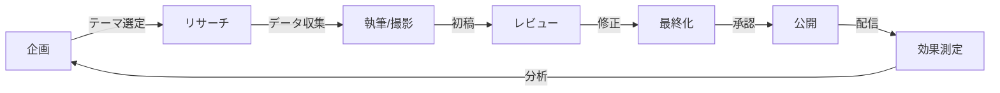

# コンテンツ戦略システム（CONTENT_SYSTEM.md）

## 🎯 コンテンツ戦略の目的
**トラフィック獲得 → 信頼構築 → リード獲得 → 顧客化**

## 1. 短尺動画コンテンツ戦略

### 1.1 プラットフォーム別戦略
```yaml
platforms:
  tiktok:
    format: 縦型9:16
    duration: 15-30秒
    posting_time: [7:00, 12:00, 19:00]
    hashtags: 
      - "#ビジネス"
      - "#起業" 
      - "#営業改革"
      - "#B2B"
    algorithm_optimization:
      - 最初の3秒で引きつける
      - ループ可能な構成
      - コメント誘導型
      
  youtube_shorts:
    format: 縦型9:16
    duration: 30-60秒
    cross_promotion: YouTubeメインチャンネルへ誘導
    
  instagram_reels:
    format: 縦型9:16
    duration: 15-30秒
    features:
      - ストーリーズ連携
      - IGTVへの展開
      - ハイライト保存
```

### 1.2 コンテンツテンプレート（30秒構成）
```javascript
const contentTemplate = {
  structure: {
    hook: {
      duration: 3,
      purpose: '視聴者を引きつける',
      examples: [
        '〇〇で売上が2倍になった理由',
        '99%の経営者が知らない〇〇',
        'たった1つの変更で〇〇'
      ]
    },
    
    problem: {
      duration: 7,
      purpose: '共感を得る',
      examples: [
        '営業の成約率が上がらない...',
        '優秀な人材が採用できない...',
        '価格競争に巻き込まれる...'
      ]
    },
    
    solution: {
      duration: 10,
      purpose: '逆張り/新視点を提供',
      examples: [
        'でも実は〇〇するだけで',
        'IPO企業は全て〇〇している',
        'AIを使えば〇〇が可能'
      ]
    },
    
    proof: {
      duration: 7,
      purpose: '信頼性を示す',
      examples: [
        '実際に〇社が成功',
        '売上〇%アップの実績',
        'データが証明している'
      ]
    },
    
    cta: {
      duration: 3,
      purpose: '行動を促す',
      examples: [
        'プロフィールのリンクから診断',
        '詳細はコメント欄',
        'フォローして最新情報を'
      ]
    }
  }
};
```

### 1.3 月間コンテンツカレンダー（30日分）
```javascript
const contentCalendar = [
  // Week 1: 価格戦略
  { day: 1, theme: '価格戦略', title: 'なぜ"広告より先に価格"を変えると売上が上がるのか' },
  { day: 2, theme: '価格戦略', title: '値引き禁止でも成約率を上げる3つの方法' },
  { day: 3, theme: '価格戦略', title: 'デコイ効果で平均単価を1.5倍にする' },
  { day: 4, theme: '価格戦略', title: 'SaaSの価格設定で失敗する理由TOP3' },
  { day: 5, theme: '価格戦略', title: '成果報酬vs固定報酬、どちらが儲かる？' },
  { day: 6, theme: '価格戦略', title: 'アップセルの成功率を50%にする方法' },
  { day: 7, theme: '価格戦略', title: '価格表を公開すべき3つの理由' },
  
  // Week 2: 営業改革
  { day: 8, theme: '営業改革', title: 'Exit基準で営業効率を2倍にする' },
  { day: 9, theme: '営業改革', title: '商談の録画が成約率を上げる理由' },
  { day: 10, theme: '営業改革', title: 'AIが営業メモから次アクションを生成' },
  { day: 11, theme: '営業改革', title: 'パイプラインカバレッジ4xの法則' },
  { day: 12, theme: '営業改革', title: 'Discovery商談で聞くべき5つの質問' },
  { day: 13, theme: '営業改革', title: 'Win率20%を超える企業の共通点' },
  { day: 14, theme: '営業改革', title: 'WBRで売上予測精度を90%にする' },
  
  // Week 3: 採用/組織
  { day: 15, theme: '採用/組織', title: '90日で成果を出す採用基準の作り方' },
  { day: 16, theme: '採用/組織', title: 'スコアカードで採用ミスをゼロにする' },
  { day: 17, theme: '採用/組織', title: 'オンボーディングの最初の30日が重要な理由' },
  { day: 18, theme: '採用/組織', title: '退職率を5%以下にする3つの施策' },
  { day: 19, theme: '採用/組織', title: 'OKRが失敗する企業の特徴' },
  { day: 20, theme: '採用/組織', title: '1on1で部下のパフォーマンスを上げる' },
  { day: 21, theme: '採用/組織', title: 'リモートワークで生産性を維持する方法' },
  
  // Week 4: IPO/成長戦略
  { day: 22, theme: 'IPO/成長', title: 'IPOまでの7つのマイルストーン' },
  { day: 23, theme: 'IPO/成長', title: '内部統制で押さえるべき3つのポイント' },
  { day: 24, theme: 'IPO/成長', title: '監査法人が見ている5つの指標' },
  { day: 25, theme: 'IPO/成長', title: 'J-SOXで準備すべき文書リスト' },
  { day: 26, theme: 'IPO/成長', title: 'VC調達vs銀行借入、どちらを選ぶ？' },
  { day: 27, theme: 'IPO/成長', title: 'ARR100億円への最短ルート' },
  { day: 28, theme: 'IPO/成長', title: 'M&Aで失敗しないDD のポイント' },
  
  // Week 5: AI/テクノロジー
  { day: 29, theme: 'AI/Tech', title: 'ChatGPTで営業資料を10分で作る' },
  { day: 30, theme: 'AI/Tech', title: 'AIで商談の勝率を予測する方法' }
];
```

## 2. ロングフォームコンテンツ

### 2.1 ブログ記事戦略
```yaml
blog_strategy:
  frequency: 週2本
  word_count: 2000-3000字
  
  categories:
    営業改革:
      topics:
        - Exit基準の設計と運用
        - パイプライン管理の最適化
        - 商談プロセスの標準化
      seo_keywords:
        - B2B営業
        - 営業効率化
        - SaaS営業
        
    価格戦略:
      topics:
        - 価格設定の心理学
        - 競合比較での差別化
        - アップセル/クロスセル設計
      seo_keywords:
        - 価格戦略
        - プライシング
        - 値上げ
        
    組織開発:
      topics:
        - 採用プロセスの構築
        - パフォーマンス管理
        - 組織文化の醸成
      seo_keywords:
        - 採用
        - 人事評価
        - 組織開発
        
    IPO準備:
      topics:
        - 内部統制の構築
        - 財務レポーティング
        - ガバナンス体制
      seo_keywords:
        - IPO準備
        - 上場準備
        - 内部統制
```

### 2.2 記事テンプレート
```markdown
# [キャッチーなタイトル]

## 導入（200字）
- 読者の課題に共感
- この記事で得られる価値
- 読了時間の目安

## 目次
- [見出し1]
- [見出し2]
- [見出し3]

## 本文（1500-2000字）
### 見出し1
- 具体例
- データ/統計
- 実践方法

### 見出し2
- ケーススタディ
- よくある失敗
- 成功のポイント

### 見出し3
- ステップバイステップ
- チェックリスト
- テンプレート提供

## アクションプラン（300字）
- 今すぐできること
- 30日で実現すること
- 長期的な取り組み

## CTA
- 5分診断への誘導
- 関連資料のダウンロード
- 無料相談の予約
```

## 3. リード獲得コンテンツ

### 3.1 ダウンロード資料
```javascript
const leadMagnets = [
  {
    title: '営業SOPテンプレート',
    format: 'Excel',
    pages: 15,
    value_prop: '即実装可能な営業プロセス',
    target_audience: '営業マネージャー',
    cta_position: 'blog_営業改革'
  },
  {
    title: '価格戦略チェックリスト',
    format: 'PDF',
    pages: 10,
    value_prop: '価格最適化の25項目',
    target_audience: '経営者/事業責任者',
    cta_position: 'pricing_page'
  },
  {
    title: '採用スコアカードサンプル',
    format: 'Google Sheets',
    pages: 5,
    value_prop: '面接評価の標準化',
    target_audience: '人事/採用担当',
    cta_position: 'blog_採用'
  },
  {
    title: 'IPOロードマップ',
    format: 'PDF',
    pages: 20,
    value_prop: '上場までの100のタスク',
    target_audience: 'CFO/経営企画',
    cta_position: 'about_page'
  },
  {
    title: 'AI活用ガイド',
    format: 'Notion',
    pages: 30,
    value_prop: '業務別AI活用事例50',
    target_audience: '全職種',
    cta_position: 'home_hero'
  }
];
```

### 3.2 ウェビナー/ワークショップ
```yaml
webinar_series:
  monthly_topics:
    - title: "営業効率を2倍にするWBRの実践"
      date: 第1火曜 14:00-15:00
      format: Zoom
      capacity: 100名
      recording: あり
      follow_up: 個別相談オファー
      
    - title: "価格を変えずに単価を上げる方法"
      date: 第2火曜 14:00-15:00
      format: Zoom
      capacity: 100名
      recording: あり
      follow_up: 価格診断オファー
      
    - title: "採用成功率を90%にする面接術"
      date: 第3火曜 14:00-15:00
      format: Zoom
      capacity: 50名
      recording: なし（限定感）
      follow_up: 採用支援オファー
      
    - title: "IPO準備の落とし穴と対策"
      date: 第4火曜 14:00-15:00
      format: Zoom
      capacity: 30名
      recording: なし（限定感）
      follow_up: IPO診断オファー
```

## 4. メールマーケティング

### 4.1 ナーチャリングシーケンス
```javascript
const emailSequence = {
  welcome_series: [
    {
      day: 0,
      subject: 'ようこそHANATABAへ',
      content: '診断結果の解説',
      cta: '詳細レポートを見る'
    },
    {
      day: 3,
      subject: 'あなたと同じ課題を解決した事例',
      content: '類似企業の成功事例',
      cta: '事例を詳しく見る'
    },
    {
      day: 7,
      subject: '無料相談の特別枠をご用意',
      content: '30分の戦略相談',
      cta: '相談を予約する'
    },
    {
      day: 14,
      subject: '限定：90日スプリントのご案内',
      content: '期間限定オファー',
      cta: '詳細を確認する'
    },
    {
      day: 21,
      subject: '最後のご案内',
      content: 'オファーの最終案内',
      cta: '今すぐ申し込む'
    }
  ],
  
  engagement_campaigns: {
    weekly_newsletter: {
      day: '毎週木曜',
      segments: ['リード', '顧客', '休眠'],
      content: ['新着記事', 'ケーススタディ', 'イベント案内']
    },
    
    monthly_report: {
      day: '月初',
      segments: ['顧客'],
      content: ['業界トレンド', 'ベストプラクティス', '新機能案内']
    }
  }
};
```

### 4.2 セグメント別メッセージング
```yaml
segments:
  cold_leads:
    tone: 教育的
    frequency: 週1回
    content_mix:
      educational: 70%
      promotional: 30%
    
  warm_leads:
    tone: 相談的
    frequency: 週2回
    content_mix:
      case_studies: 40%
      educational: 40%
      promotional: 20%
    
  customers:
    tone: パートナー的
    frequency: 週1回
    content_mix:
      success_tips: 50%
      new_features: 30%
      upsell: 20%
    
  churned:
    tone: 再エンゲージメント
    frequency: 月1回
    content_mix:
      updates: 50%
      win_back_offers: 50%
```

## 5. SNS戦略

### 5.1 プラットフォーム別運用
```javascript
const socialStrategy = {
  twitter: {
    posts_per_day: 3,
    content_types: ['思考', 'データ', 'リンク'],
    engagement_tactics: ['質問', 'アンケート', 'スレッド'],
    hashtags: ['#B2B営業', '#スタートアップ', '#SaaS']
  },
  
  linkedin: {
    posts_per_week: 5,
    content_types: ['記事', 'ケーススタディ', '業界分析'],
    engagement_tactics: ['ディスカッション', '専門知識共有'],
    groups: ['B2B営業', 'SaaS経営者', 'IPO準備']
  },
  
  facebook: {
    posts_per_week: 3,
    content_types: ['ブログ記事', 'イベント', '動画'],
    ad_strategy: {
      audiences: ['経営者', '営業責任者', 'スタートアップ'],
      budget: 100000, // 月額
      objectives: ['リード獲得', 'ブランド認知']
    }
  }
};
```

### 5.2 インフルエンサー連携
```yaml
influencer_strategy:
  tier_1: # 10万フォロワー以上
    targets:
      - ビジネス系YouTuber
      - 経営者インフルエンサー
    collaboration:
      - ゲスト出演
      - 共同ウェビナー
    budget: 500000/回
    
  tier_2: # 1-10万フォロワー
    targets:
      - 業界専門家
      - コンサルタント
    collaboration:
      - 記事寄稿
      - 相互紹介
    budget: 100000/回
    
  tier_3: # 1万フォロワー以下
    targets:
      - ニッチ専門家
      - 顧客アドボケート
    collaboration:
      - 事例紹介
      - testimonial
    budget: インセンティブ/無償
```

## 6. コンテンツ制作プロセス

### 6.1 制作フロー


### 6.2 品質チェックリスト
```javascript
const qualityChecklist = {
  content: [
    '読者の課題を明確に定義しているか',
    '具体的な解決策を提示しているか',
    'データや事例で裏付けているか',
    'CTAが明確か'
  ],
  
  seo: [
    'キーワードが適切に配置されているか',
    'メタディスクリプションは最適化されているか',
    '見出し構造は適切か',
    '内部リンクは設置されているか'
  ],
  
  engagement: [
    'タイトルは興味を引くか',
    'ビジュアルは効果的か',
    'シェアしやすい内容か',
    'コメントを促す要素があるか'
  ]
};
```

## 7. 効果測定とKPI

### 7.1 コンテンツKPI
```yaml
kpis:
  awareness:
    - impressions: 月間100万
    - reach: 月間50万人
    - brand_searches: 月間1000回
    
  engagement:
    - avg_time_on_page: 3分以上
    - bounce_rate: 50%以下
    - social_shares: 記事あたり50回
    - comments: 記事あたり10件
    
  conversion:
    - content_to_lead: 2%
    - lead_to_mql: 25%
    - mql_to_sql: 40%
    - sql_to_customer: 20%
    
  retention:
    - email_open_rate: 25%
    - click_rate: 5%
    - unsubscribe_rate: 1%以下
```

### 7.2 ROI計算
```javascript
const contentROI = {
  costs: {
    production: 500000, // 月額制作費
    promotion: 200000, // 月額広告費
    tools: 50000, // 月額ツール費
    total: 750000
  },
  
  returns: {
    direct_leads: {
      count: 50,
      conversion_rate: 0.2,
      customer_value: 3600000,
      revenue: 36000000 // 50 * 0.2 * 3,600,000
    },
    
    brand_value: {
      estimated: 5000000 // ブランド価値向上
    },
    
    total: 41000000
  },
  
  roi: 5366 // (41,000,000 - 750,000) / 750,000 * 100
};
```

## 8. 実装チェックリスト

### Week 1: 基盤構築
- [ ] コンテンツカレンダー作成
- [ ] 制作チーム編成
- [ ] ツール導入（撮影/編集/配信）
- [ ] テンプレート作成

### Week 2: 制作開始
- [ ] 短尺動画10本制作
- [ ] ブログ記事2本執筆
- [ ] リードマグネット1つ作成
- [ ] メールシーケンス設定

### Week 3: 配信開始
- [ ] SNSアカウント最適化
- [ ] 初回コンテンツ投稿
- [ ] 広告キャンペーン開始
- [ ] インフルエンサーアプローチ

### Week 4: 最適化
- [ ] パフォーマンス分析
- [ ] A/Bテスト実施
- [ ] コンテンツ改善
- [ ] スケール計画策定

---
*コンテンツは資産。長期的視点で価値を積み上げていくこと*