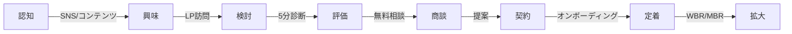

# プロダクト/オファー設計（PRODUCT_DESIGN.md）

## 🎯 プロダクト戦略
**USP**: IPOの地図 × 20歳の羅針盤 × AIの推進力で、今日の売上まで引き上げる

## 1. プロダクトラインナップ

### 1.1 90日スプリント（Good）
```yaml
product:
  name: 90日スプリント
  price: ¥1,500,000
  duration: 90日間
  
  deliverables:
    week_1-2:
      - 現状診断レポート
      - 改善ロードマップ
      - KPI設計書
      
    week_3-6:
      - 営業SOP構築
      - 価格戦略設計
      - 採用プロセス設計
      
    week_7-10:
      - 実装サポート
      - チームトレーニング
      - 週次レビュー実施
      
    week_11-12:
      - 成果測定
      - 是正アクション
      - 継続計画策定
  
  sla:
    response_time: 24時間以内
    weekly_review: 必須
    success_criteria: KPI達成率80%以上
```

### 1.2 HANATABA Core リテイナー（Better）
```yaml
product:
  name: HANATABA Core リテイナー
  price: ¥300,000/月
  annual_value: ¥3,600,000
  commitment: 12ヶ月
  
  services:
    定例会議:
      - WBR（週次ビジネスレビュー）: 毎週60分
      - MBR（月次ビジネスレビュー）: 月1回90分
      - QBR（四半期ビジネスレビュー）: 四半期120分
    
    実働支援:
      - 営業同行: 月2回まで
      - 提案書レビュー: 無制限
      - 採用面接同席: 月2名まで
      
    戦略支援:
      - KPI設計/見直し
      - 価格戦略アドバイス
      - 組織設計サポート
  
  included_hours: 20時間/月
  additional_rate: ¥30,000/時間
```

### 1.3 Core＋AI RevOps Pack（Best/デコイ）
```yaml
product:
  name: Core＋AI RevOps Pack
  price: ¥450,000/月
  annual_value: ¥5,400,000
  positioning: デコイ商品
  
  core_features: HANATABA Core全機能
  
  ai_features:
    自動化:
      - 商談メモ→リスクスコア自動算出
      - Exit基準の自動チェック
      - 次アクション自動提案
      
    分析:
      - パイプライン健全性診断
      - Win/Loss自動分析
      - 予測精度向上
      
    レビュー:
      - 提案書の自動採点
      - 価格妥当性チェック
      - 競合比較分析
  
  roi_promise: 営業効率30%向上
```

## 2. サービス設計詳細

### 2.1 診断サービス（リードジェネレーション）
```javascript
const diagnosticService = {
  name: '5分診断',
  price: 0,
  duration: '5分',
  
  questions: [
    {
      id: 'q1',
      text: '現在の年商規模は？',
      options: ['1億円未満', '1-3億円', '3-10億円', '10億円以上'],
      weight: 0.2
    },
    {
      id: 'q2', 
      text: '最も改善したい領域は？',
      options: ['営業', '採用', '価格戦略', '組織運営'],
      weight: 0.3
    },
    {
      id: 'q3',
      text: '営業のWin率は？',
      options: ['10%未満', '10-20%', '20-30%', '30%以上'],
      weight: 0.25
    },
    {
      id: 'q4',
      text: 'CRMの活用度は？',
      options: ['未導入', '導入済み未活用', '部分活用', 'フル活用'],
      weight: 0.15
    },
    {
      id: 'q5',
      text: '経営陣のコミット度は？',
      options: ['低い', '普通', '高い', '非常に高い'],
      weight: 0.1
    }
  ],
  
  scoring: {
    poor: { range: [0, 40], action: '緊急改善が必要', cta: '今すぐ相談' },
    fair: { range: [41, 60], action: '改善余地大', cta: '詳細診断を受ける' },
    good: { range: [61, 80], action: '部分最適化で成長可能', cta: '改善プラン確認' },
    excellent: { range: [81, 100], action: '先進事例として共有可能', cta: '事例掲載相談' }
  }
};
```

### 2.2 コンサルティングメソドロジー
```yaml
methodology:
  name: HANATABA Growth Framework
  
  phases:
    1_discovery:
      duration: 2週間
      activities:
        - 現状分析（データ収集）
        - ステークホルダーインタビュー
        - 競合ベンチマーク
        - 機会領域特定
      deliverable: 診断レポート
      
    2_design:
      duration: 4週間
      activities:
        - 戦略立案
        - プロセス設計
        - KPI/OKR設定
        - 実装計画策定
      deliverable: 戦略設計書
      
    3_implement:
      duration: 4週間
      activities:
        - パイロット実施
        - チーム育成
        - ツール導入
        - 初期成果測定
      deliverable: 実装レポート
      
    4_optimize:
      duration: 2週間
      activities:
        - 成果分析
        - 是正措置
        - スケール計画
        - 引き継ぎ準備
      deliverable: 最終報告書
```

### 2.3 ワークショップ/トレーニング
```javascript
const workshops = {
  catalog: [
    {
      name: 'IPOレディネス診断',
      duration: '半日',
      price: 300000,
      participants: '経営陣5名まで',
      output: 'IPOロードマップ'
    },
    {
      name: '営業SOP構築',
      duration: '2日間',
      price: 500000,
      participants: '営業チーム10名まで',
      output: 'SOP＋プレイブック'
    },
    {
      name: '価格戦略ワークショップ',
      duration: '1日',
      price: 400000,
      participants: '営業/マーケ/経営',
      output: '価格表＋ディスカウントルール'
    },
    {
      name: 'AI活用トレーニング',
      duration: '1日',
      price: 350000,
      participants: '全社員',
      output: 'AI活用ガイドライン'
    }
  ]
};
```

## 3. 成果物テンプレート

### 3.1 診断レポート
```markdown
# [会社名] 成長診断レポート

## エグゼクティブサマリー
- 総合スコア: XX/100
- 優先改善領域: [営業/採用/価格]
- 推定改善インパクト: 売上+XX%

## 現状分析
### 強み
- [具体的な強み]

### 改善機会
- [具体的な改善点]

## 推奨アクション
1. 即実行（Quick Win）
2. 30日以内
3. 90日計画

## ROI試算
- 投資額: ¥X,XXX,XXX
- 期待リターン: ¥XX,XXX,XXX
- 回収期間: XX ヶ月
```

### 3.2 営業SOP
```yaml
sales_sop_template:
  discovery:
    objective: 課題と予算の特定
    duration: 30分
    key_questions:
      - 現在の最大の課題は？
      - 予算と決裁プロセスは？
      - 導入時期の希望は？
    exit_criteria:
      - BANT確認完了
      - 次回アクション設定
      
  qualification:
    objective: 提案価値の検証
    duration: 45分
    activities:
      - デモ/事例紹介
      - ROI試算提示
      - 競合比較
    exit_criteria:
      - 意思決定者の参加確約
      - 提案書作成合意
      
  proposal:
    objective: 契約条件合意
    duration: 60分
    components:
      - カスタマイズ提案
      - 価格/条件提示
      - 実装計画
    exit_criteria:
      - 条件合意
      - 契約締結日設定
```

### 3.3 KPIダッシュボード
```javascript
const kpiDashboard = {
  revenue_metrics: {
    mrr: { current: 0, target: 10000000, unit: '円' },
    arr: { current: 0, target: 120000000, unit: '円' },
    acv: { current: 0, target: 3600000, unit: '円' }
  },
  
  sales_metrics: {
    pipeline_value: { current: 0, target: 40000000 },
    win_rate: { current: 0, target: 0.25 },
    sales_cycle: { current: 0, target: 45, unit: '日' }
  },
  
  customer_metrics: {
    nps: { current: 0, target: 50 },
    retention_rate: { current: 0, target: 0.92 },
    nrr: { current: 0, target: 1.12 }
  }
};
```

## 4. 差別化要素

### 4.1 三位一体モデル
```
      IPO経験
         ↓
    [HANATABA]
    ↙        ↘
20歳視点    AI推進力
```

### 4.2 独自の強み
```yaml
differentiators:
  ipoExperience:
    - 上場企業の成功パターン
    - 監査法人対応ノウハウ
    - 内部統制構築
    
  youthPerspective:
    - Z世代マーケット理解
    - 最新ツール活用
    - アジャイル実装
    
  aiIntegration:
    - 自動化による効率化
    - データドリブン意思決定
    - 予測精度向上
```

## 5. 価格戦略

### 5.1 価格設定ロジック
```javascript
const pricingLogic = {
  costPlus: {
    laborCost: 25000, // 時給
    overhead: 1.3, // 間接費率
    targetMargin: 0.6 // 粗利率
  },
  
  valueBase: {
    clientRevenue: 100000000, // 顧客年商
    improvementRate: 0.2, // 改善率
    shareOfGain: 0.15 // 成果配分
  },
  
  competitive: {
    mckinsey: 10000000, // 大手コンサル
    boutique: 3000000, // ブティック
    hanataba: 3600000 // ポジショニング
  }
};
```

### 5.2 ディスカウントポリシー
```yaml
discount_policy:
  prohibited:
    - 単純な値引き
    - 根拠のない割引
    
  allowed:
    - 範囲調整（スコープ削減）
    - 成果連動（パフォーマンスベース）
    - 長期契約（18ヶ月以上で5%）
    - 事例公開許可（10%）
```

## 6. カスタマージャーニー

### 6.1 タッチポイント設計


### 6.2 各ステージのKPI
```javascript
const journeyKPIs = {
  awareness: { metric: 'リーチ数', target: 100000 },
  interest: { metric: 'LP訪問数', target: 10000 },
  consideration: { metric: '診断開始数', target: 500 },
  evaluation: { metric: '診断完了数', target: 250 },
  negotiation: { metric: '商談数', target: 50 },
  purchase: { metric: '成約数', target: 10 },
  onboarding: { metric: '定着率', target: 0.95 },
  expansion: { metric: 'NRR', target: 1.12 }
};
```

## 7. 実装チェックリスト

### Week 1
- [ ] 価格表の最終化
- [ ] 診断フォームの実装
- [ ] 提案書テンプレート作成
- [ ] SLA文書作成

### Week 2
- [ ] オンボーディング資料作成
- [ ] ワークショップコンテンツ開発
- [ ] 成果物サンプル準備
- [ ] FAQ文書化

### Week 3-4
- [ ] 営業トレーニング実施
- [ ] デモ環境構築
- [ ] 顧客ポータル開発
- [ ] 請求システム連携

---
*定期的にプロダクト-マーケットフィットを検証し、必要に応じて調整すること*