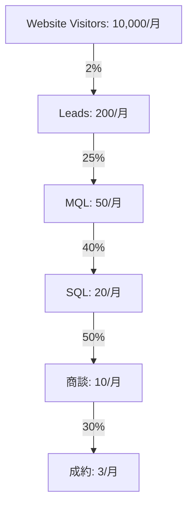

# REVENUE_STRATEGY.md - 収益戦略詳細設計

## 💎 価格戦略

### Pricing Tiers

#### 🥉 Good Plan - スタートアップ向け
```yaml
price: ¥100,000/月
target: 
  - 創業1-3年
  - 従業員10名以下
  - 売上1億円未満
features:
  - 月1回のオンライン面談
  - IPO診断レポート
  - 基本的な資料テンプレート
  - Slackサポート
value_prop: "IPO準備の第一歩を踏み出す"
```

#### 🥈 Better Plan - 成長企業向け
```yaml
price: ¥300,000/月
target:
  - 創業3-5年
  - 従業員10-50名
  - 売上1-10億円
features:
  - 週1回のオンライン面談
  - 詳細なIPOロードマップ
  - カスタマイズ資料作成
  - 投資家紹介（月3社）
  - 24時間サポート
value_prop: "確実な成長軌道に乗せる"
```

#### 🥇 Best Plan - IPO直前企業向け
```yaml
price: ¥1,000,000/月
target:
  - 創業5年以上
  - 従業員50名以上
  - 売上10億円以上
features:
  - 無制限の1対1面談
  - CEO直接メンタリング
  - 完全カスタマイズ支援
  - 投資家紹介（無制限）
  - 上場準備チーム派遣
  - 成功報酬オプション
value_prop: "IPO成功を確実にする"
```

### 🎯 成功報酬モデル
```javascript
const successFeeModel = {
  base: {
    monthly: 1000000,  // 月額100万円
    duration: 12       // 12ヶ月契約
  },
  success: {
    ipo: {
      percentage: 1,   // 時価総額の1%
      minimum: 50000000,  // 最低5000万円
      maximum: 300000000  // 最大3億円
    },
    ma: {
      percentage: 3,   // 売却額の3%
      minimum: 30000000,  // 最低3000万円
    }
  }
};
```

## 📈 収益予測

### Year 1 - 立ち上げ期
```yaml
Q1:
  customers: 3
  mrr: ¥1,000,000
  arr: ¥12,000,000

Q2:
  customers: 10
  mrr: ¥3,000,000
  arr: ¥36,000,000

Q3:
  customers: 25
  mrr: ¥8,000,000
  arr: ¥96,000,000

Q4:
  customers: 50
  mrr: ¥15,000,000
  arr: ¥180,000,000
```

### Year 2 - 成長期
```yaml
target:
  customers: 200
  mrr: ¥60,000,000
  arr: ¥720,000,000
  success_fees: ¥300,000,000
```

### Year 3 - 拡大期
```yaml
target:
  customers: 500
  mrr: ¥150,000,000
  arr: ¥1,800,000,000
  success_fees: ¥1,000,000,000
```

## 🎪 セールスファネル

### ファネル構造


### CAC最適化
```javascript
const customerAcquisition = {
  channels: {
    organic: {
      cost: 50000,
      conversion: 0.03,
      cac: 16667
    },
    paid: {
      cost: 300000,
      conversion: 0.02,
      cac: 150000
    },
    referral: {
      cost: 100000,
      conversion: 0.15,
      cac: 6667
    }
  },
  target_cac: 100000,
  payback_period: 3  // months
};
```

## 💰 Unit Economics

### LTV計算
```javascript
const ltv = {
  good: {
    monthly_revenue: 100000,
    avg_retention: 12,  // months
    gross_margin: 0.8,
    ltv: 100000 * 12 * 0.8  // ¥960,000
  },
  better: {
    monthly_revenue: 300000,
    avg_retention: 18,
    gross_margin: 0.85,
    ltv: 300000 * 18 * 0.85  // ¥4,590,000
  },
  best: {
    monthly_revenue: 1000000,
    avg_retention: 24,
    gross_margin: 0.9,
    ltv: 1000000 * 24 * 0.9  // ¥21,600,000
  }
};
```

### LTV/CAC比率
- **Target**: 3:1以上
- **Good Plan**: 9.6:1
- **Better Plan**: 30.6:1
- **Best Plan**: 43.2:1

## 🔄 アップセル戦略

### アップセルトリガー
1. **従業員数増加** → プラン提案
2. **売上成長** → 上位プラン移行
3. **IPO準備フェーズ** → Bestプラン
4. **追加機能要望** → カスタムプラン

### クロスセル商品
- **IPO準備ブートキャンプ**: ¥500,000
- **投資家ピッチトレーニング**: ¥300,000
- **DD対策パッケージ**: ¥1,000,000
- **IR戦略策定**: ¥2,000,000

## 📊 Revenue Mix

### 収益構成目標（Year 3）
```javascript
const revenueMix = {
  recurring: {
    percentage: 60,
    amount: 1080000000
  },
  success_fee: {
    percentage: 30,
    amount: 540000000
  },
  one_time: {
    percentage: 10,
    amount: 180000000
  }
};
```

## 🎯 KPI & Metrics

### 月次追跡指標
- **MRR成長率**: > 20%
- **Churn Rate**: < 5%
- **Net Revenue Retention**: > 110%
- **Gross Margin**: > 80%
- **CAC Payback**: < 6ヶ月

### コホート分析
```javascript
const cohortMetrics = {
  month_1_retention: 0.95,
  month_3_retention: 0.85,
  month_6_retention: 0.75,
  month_12_retention: 0.65,
  expansion_revenue: 1.3  // 130% of initial
};
```

## 💳 決済システム

### 支払い方法
- **クレジットカード**: Stripe
- **銀行振込**: 月末締め翌月末払い
- **請求書払い**: 大企業向け

### 契約条件
- **最低契約期間**: 6ヶ月
- **解約通知**: 1ヶ月前
- **返金ポリシー**: 初月のみ全額返金保証

## 🚀 成長戦略

### Phase 1: Product-Market Fit（0-6ヶ月）
- 10社の成功事例作成
- NPS > 70達成
- Product改善サイクル確立

### Phase 2: Scale（6-18ヶ月）
- 営業チーム構築
- マーケティング自動化
- パートナーシップ確立

### Phase 3: Expansion（18-36ヶ月）
- 海外展開
- M&A
- IPO準備

---

**Financial Model**: [Google Sheets](https://docs.google.com/spreadsheets/)
**Dashboard**: [Tableau](https://tableau.com/)
**Last Updated**: 2024年12月